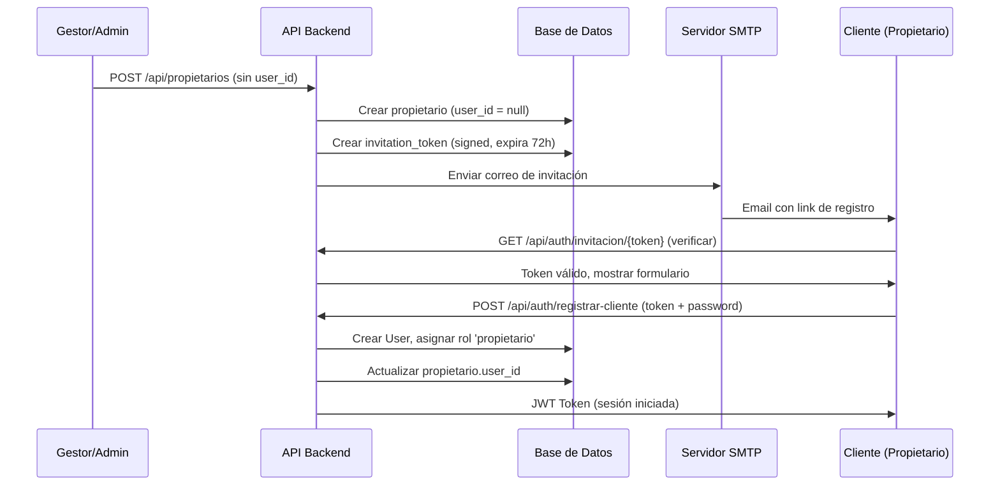

# Gestión de Usuarios y Roles con Spatie

## Contexto

El sistema de veterinaria actualmente tiene:
- **Spatie v7.2** ya instalado con `HasRoles` en el modelo `User`
- **5 roles** definidos en seeder: `admin`, `gestor`, `recepcionista`, `veterinario`, `propietario`
- **48 permisos** CRUD organizados por módulo
- **JWT Auth** (tymon/jwt-auth) para autenticación API
- **Relación** `propietarios.user_id → users.id` ya existente
- **Sin middleware de autorización** aplicado en rutas (todas las rutas protegidas solo verifican `auth:api`)

## Objetivo

Implementar control de acceso real basado en roles/permisos con 3 niveles jerárquicos principales:

| Rol | Descripción | Capacidades |
|---|---|---|
| **admin** | Omnipotente (tú) | Todo. Acceso total al sistema |
| **gestor** | Máxima autoridad del área usuaria | Gestiona usuarios internos (recepcionista, veterinario). CRUD de la entidad |
| **propietario** (cliente) | Dueño de mascotas | Vista limitada: sus mascotas, citas, recetas. Registra credenciales vía email |

---

## User Review Required

> [!IMPORTANT]
> **Flujo de registro del propietario (cliente)**: Cuando un gestor o admin creen un `Propietario`, el sistema le enviará un correo de invitación al email del propietario con un **link temporal (signed URL)** para que registre sus credenciales (user + password). Esto significa que el `propietario` NO será creado con un `user_id` obligatorio desde el inicio — se creará primero sin usuario, y el usuario se crea cuando el propietario acepte la invitación.

> [!WARNING]
> **Cambio breaking en `StorePropietarioRequest`**: El campo `user_id` pasará de `required` a ser **excluido del request**. El `user_id` se asignará automáticamente cuando el propietario registre sus credenciales. La columna `user_id` en la tabla `propietarios` pasará a ser `nullable`.

> [!IMPORTANT]
> **El endpoint `POST /api/auth/register` público actual debe eliminarse o restringirse**. Actualmente cualquiera puede registrarse y obtener el rol `propietario`. Con el nuevo flujo, solo admin/gestor invitan clientes, y el registro se hace por token.

---

## Proposed Changes

### Fase 1: Middleware de Autorización por Permisos

Aplicar los permisos de Spatie que ya existen a las rutas reales. Actualmente ningún endpoint verifica permisos.

#### [MODIFY] [api.php](file:///c:/Users/rmedina/Herd/veterinaria/routes/api.php)

Agregar middleware `permission:` de Spatie a cada grupo de rutas:

```php
Route::middleware('auth:api')->group(function () {
    // --- Gestión de Usuarios (admin, gestor) ---
    Route::middleware('permission:ver usuarios')->group(function () {
        Route::apiResource('usuarios', UserController::class);
    });

    // --- Propietarios ---
    Route::middleware('permission:ver mascotas')->group(function () {
        Route::apiResource('propietarios', PropietarioController::class);
    });

    // --- Animales ---
    Route::middleware('permission:ver mascotas')->group(function () {
        Route::apiResource('animales', AnimalController::class);
    });

    // --- Instrumentos ---
    Route::middleware('permission:ver instrumentos')->group(function () {
        Route::apiResource('instrumentos', InstrumentoController::class);
    });

    // ... etc para cada recurso
});
```

> [!NOTE]
> Spatie permite middleware granular por acción (`permission:crear mascotas` en `store`), pero para mantenerlo simple, se aplica el permiso de "ver" al grupo y permisos específicos de escritura dentro de los controllers con `$this->authorize()` o `can()`.

---

### Fase 2: Gestión de Usuarios (CRUD para admin/gestor)

#### [NEW] [UserController.php](file:///c:/Users/rmedina/Herd/veterinaria/app/Http/Controllers/UserController.php)

Controller CRUD para gestionar usuarios internos:
- `index()` — Listar usuarios (admin ve todos, gestor solo los de menor privilegio)
- `store()` — Crear usuario con rol asignado
  - **Admin**: puede crear cualquier rol
  - **Gestor**: solo puede crear `recepcionista`, `veterinario`
  - No puede crear `admin` ni otro `gestor`
- `show()` / `update()` / `destroy()` — CRUD estándar con validación de jerarquía

#### [NEW] [UserService.php](file:///c:/Users/rmedina/Herd/veterinaria/app/Services/UserService.php)
#### [NEW] [UserServiceInterface.php](file:///c:/Users/rmedina/Herd/veterinaria/app/Services/Contracts/UserServiceInterface.php)

Service con lógica de negocio:
- Validar que el rol asignado sea permitido según quién lo crea
- Hashear password
- Asignar rol via Spatie

#### [NEW] [StoreUserRequest.php](file:///c:/Users/rmedina/Herd/veterinaria/app/Http/Requests/User/StoreUserRequest.php)

```php
public function rules(): array
{
    return [
        'name'     => ['required', 'string', 'max:255'],
        'email'    => ['required', 'email', 'unique:users,email'],
        'password' => ['required', 'string', 'min:8', 'confirmed'],
        'role'     => ['required', 'string', 'in:gestor,recepcionista,veterinario'],
    ];
}
```

#### [NEW] [UpdateUserRequest.php](file:///c:/Users/rmedina/Herd/veterinaria/app/Http/Requests/User/UpdateUserRequest.php)

#### [NEW] [CreateUserDTO.php](file:///c:/Users/rmedina/Herd/veterinaria/app/DTOs/User/CreateUserDTO.php)
#### [NEW] [UpdateUserDTO.php](file:///c:/Users/rmedina/Herd/veterinaria/app/DTOs/User/UpdateUserDTO.php)

---

### Fase 3: Flujo de Invitación del Cliente (Propietario)

Este es el flujo más complejo. Diagrama:



#### [NEW] [Migration: add_invitation_fields_to_propietarios](file:///c:/Users/rmedina/Herd/veterinaria/database/migrations/xxxx_add_invitation_fields_to_propietarios_table.php)

```php
Schema::table('propietarios', function (Blueprint $table) {
    $table->foreignUuid('user_id')->nullable()->change(); // hacer nullable
    $table->string('invitation_token', 64)->nullable()->unique();
    $table->timestamp('invitation_sent_at')->nullable();
    $table->timestamp('invitation_accepted_at')->nullable();
});
```

#### [MODIFY] [Propietario.php](file:///c:/Users/rmedina/Herd/veterinaria/app/Models/Propietario.php)

- Agregar campos de invitación a `$fillable`
- Agregar método `isInvitationPending()`, `hasUser()`
- Agregar relación inversa `user()`

#### [MODIFY] [StorePropietarioRequest.php](file:///c:/Users/rmedina/Herd/veterinaria/app/Http/Requests/Propietario/StorePropietarioRequest.php)

- Eliminar `user_id` de `required` y de las reglas
- `email` pasa a ser **required** (necesario para enviar la invitación)

```php
public function rules(): array
{
    return [
        'tipo_doc' => ['required', 'string', 'exists:tipo_documentos,codigo'],
        'nro_doc'  => ['required', 'integer', 'unique:propietarios,nro_doc'],
        'nombre'   => ['required', 'string', 'max:255'],
        'paterno'  => ['required', 'string', 'max:255'],
        'materno'  => ['nullable', 'string', 'max:255'],
        'email'    => ['required', 'email', 'max:255', 'unique:propietarios,email'],
        'celular'  => ['nullable', 'integer'],
        'nro_emergencia' => ['nullable', 'integer'],
    ];
}
```

#### [MODIFY] [CreatePropietarioDTO.php](file:///c:/Users/rmedina/Herd/veterinaria/app/DTOs/Propietario/CreatePropietarioDTO.php)

- Eliminar `user_id` del constructor
- `email` pasa a ser `string` (no nullable)

#### [MODIFY] [PropietarioService.php](file:///c:/Users/rmedina/Herd/veterinaria/app/Services/PropietarioService.php)

En el método `create()`:
1. Crear propietario sin `user_id`
2. Generar `invitation_token` (usando `Str::random(64)`)
3. Despachar `Mail` de invitación
4. Registrar `invitation_sent_at`

#### [NEW] [ClienteInvitationMail.php](file:///c:/Users/rmedina/Herd/veterinaria/app/Mail/ClienteInvitationMail.php)

Mailable que contiene:
- Nombre del propietario
- Link con token firmado para registrar credenciales
- Expiración de 72 horas

```php
class ClienteInvitationMail extends Mailable
{
    use Queueable, SerializesModels;

    public function __construct(
        public readonly Propietario $propietario,
        public readonly string $registrationUrl,
    ) {}

    public function envelope(): Envelope
    {
        return new Envelope(
            subject: 'Bienvenido a Veterinaria - Registra tu cuenta',
        );
    }

    public function content(): Content
    {
        return new Content(
            markdown: 'emails.cliente-invitation',
        );
    }
}
```

#### [NEW] [cliente-invitation.blade.php](file:///c:/Users/rmedina/Herd/veterinaria/resources/views/emails/cliente-invitation.blade.php)

Template del correo de invitación usando componentes de Laravel Mail.

#### [NEW] [ClienteRegistrationController.php](file:///c:/Users/rmedina/Herd/veterinaria/app/Http/Controllers/ClienteRegistrationController.php)

Dos endpoints públicos (sin auth):

```php
// Verificar que el token de invitación es válido
GET /api/auth/invitacion/{token}

// Registrar credenciales del cliente
POST /api/auth/registrar-cliente
{
    "token": "abc123...",
    "password": "miPassword123",
    "password_confirmation": "miPassword123"
}
```

Lógica del registro:
1. Validar token existe y no está expirado (72h)
2. Crear `User` con email del propietario
3. Asignar rol `propietario` via Spatie
4. Actualizar `propietarios.user_id`
5. Marcar `invitation_accepted_at`
6. Invalidar token
7. Retornar JWT

#### [NEW] [RegisterClienteRequest.php](file:///c:/Users/rmedina/Herd/veterinaria/app/Http/Requests/Auth/RegisterClienteRequest.php)

---

### Fase 4: Vista de Cliente (Endpoints Propios)

El propietario autenticado solo debe ver **sus propios datos**.

#### [NEW] [ClienteController.php](file:///c:/Users/rmedina/Herd/veterinaria/app/Http/Controllers/ClienteController.php)

Endpoints exclusivos del rol `propietario`:

```php
// Datos propios del propietario
GET /api/cliente/perfil

// Mascotas del propietario autenticado
GET /api/cliente/mascotas
GET /api/cliente/mascotas/{id}

// Citas del propietario
GET /api/cliente/citas

// Recetas de sus mascotas
GET /api/cliente/recetas
```

Todos estos endpoints filtran automáticamente por `propietario.user_id = auth()->id()`.

#### [MODIFY] [api.php](file:///c:/Users/rmedina/Herd/veterinaria/routes/api.php)

```php
// Rutas públicas de registro de cliente
Route::get('auth/invitacion/{token}', [ClienteRegistrationController::class, 'verify']);
Route::post('auth/registrar-cliente', [ClienteRegistrationController::class, 'register']);

// Rutas del cliente autenticado
Route::middleware(['auth:api', 'role:propietario'])->prefix('cliente')->group(function () {
    Route::get('perfil', [ClienteController::class, 'perfil']);
    Route::get('mascotas', [ClienteController::class, 'mascotas']);
    Route::get('mascotas/{id}', [ClienteController::class, 'mascota']);
    Route::get('citas', [ClienteController::class, 'citas']);
    Route::get('recetas', [ClienteController::class, 'recetas']);
});
```

---

### Fase 5: Reestructurar AuthController

#### [MODIFY] [AuthController.php](file:///c:/Users/rmedina/Herd/veterinaria/app/Http/Controllers/AuthController.php)

- **Eliminar** el endpoint público `POST /api/auth/register` (ya no se auto-registran)
- Mantener: `login`, `me`, `logout`, `refresh`
- Agregar los roles y permisos del usuario en la respuesta de `me()`

#### [MODIFY] [User.php](file:///c:/Users/rmedina/Herd/veterinaria/app/Models/User.php)

- Agregar relación `propietario()` (hasOne)
- Agregar método helper `isAdmin()`, `isGestor()`, `isCliente()`

---

### Fase 6: Configuración SMTP

#### [MODIFY] [.env](file:///c:/Users/rmedina/Herd/veterinaria/.env)

```env
MAIL_MAILER=smtp
MAIL_HOST=smtp.tuservidor.com
MAIL_PORT=587
MAIL_USERNAME=tu-email@dominio.com
MAIL_PASSWORD=tu-password
MAIL_ENCRYPTION=tls
MAIL_FROM_ADDRESS=noreply@veterinaria.com
MAIL_FROM_NAME="Veterinaria"
```

> [!IMPORTANT]
> Necesito que me proporciones los datos de tu servidor SMTP para completar esta configuración. Si quieres probar localmente primero, podemos usar [Mailpit](https://mailpit.axllent.org/) (incluido en Laravel Herd) o `MAIL_MAILER=log` para ver los correos en el log.

---

### Fase 7: Seeder del Admin Inicial

#### [MODIFY] [RolesAndPermissionsSeeder.php](file:///c:/Users/rmedina/Herd/veterinaria/database/seeders/RolesAndPermissionsSeeder.php)

Agregar la creación del usuario admin inicial:

```php
// Crear usuario admin
$admin = User::create([
    'name' => 'Rodrigo Medina',
    'email' => 'admin@veterinaria.com',
    'password' => bcrypt('password'), // Cambiar después
]);
$admin->assignRole('admin');
```

Agregar permisos faltantes al gestor:
```php
$gestorRole->givePermissionTo([
    'crear usuarios', 'editar usuarios', // para crear recepcionista/veterinario
    // ... permisos actuales
]);
```

---

## Resumen de Archivos

| Acción | Archivo | Descripción |
|---|---|---|
| NEW | `UserController.php` | CRUD de usuarios internos |
| NEW | `UserService.php` + Interface | Lógica de gestión de usuarios |
| NEW | `StoreUserRequest.php` | Validación crear usuario |
| NEW | `UpdateUserRequest.php` | Validación actualizar usuario |
| NEW | `CreateUserDTO.php` / `UpdateUserDTO.php` | DTOs de usuario |
| NEW | `ClienteRegistrationController.php` | Registro por invitación |
| NEW | `ClienteController.php` | Endpoints vista cliente |
| NEW | `ClienteInvitationMail.php` | Mailable de invitación |
| NEW | `RegisterClienteRequest.php` | Validación registro cliente |
| NEW | `cliente-invitation.blade.php` | Template email |
| NEW | Migration invitation fields | Campos de invitación en propietarios |
| MODIFY | `api.php` | Middleware permisos + nuevas rutas |
| MODIFY | `AuthController.php` | Eliminar register público |
| MODIFY | `PropietarioService.php` | Generar invitación al crear |
| MODIFY | `StorePropietarioRequest.php` | Quitar user_id, requerir email |
| MODIFY | `CreatePropietarioDTO.php` | Quitar user_id |
| MODIFY | `Propietario.php` | Campos invitación |
| MODIFY | `User.php` | Relación propietario() |
| MODIFY | `.env` | Config SMTP |
| MODIFY | `RolesAndPermissionsSeeder.php` | Admin inicial + permisos gestor |

---

## Open Questions

> [!IMPORTANT]
> 1. **¿El gestor puede reenviar la invitación** si el cliente no la recibió o expiró?
> 2. **¿Quieres usar Mailpit** (incluido en Herd) para probar los correos localmente, o ya tienes un servidor SMTP?
> 3. **¿El admin se crea por seeder** con credenciales fijas que luego cambias, o prefieres un comando artisan `php artisan make:admin`?
> 4. **¿El propietario puede editar su propio perfil** (nombre, celular, etc.) desde la vista de cliente?
> 5. **¿Quieres que el gestor pueda ver/gestionar propietarios y animales**, o solo usuarios internos?

---

## Verification Plan

### Automated Tests
```bash
# Verificar que los middleware bloquean acceso sin permisos
php artisan test --filter=AuthorizationTest

# Verificar flujo de invitación
php artisan test --filter=ClienteInvitationTest

# Verificar que propietario solo ve sus datos
php artisan test --filter=ClienteAccessTest
```

### Manual Verification
- Probar en Swagger que un usuario sin permisos recibe 403
- Crear propietario → verificar que el email de invitación llega (log o Mailpit)
- Usar el link de invitación para registrar credenciales
- Verificar que el cliente solo ve sus mascotas
- Verificar que gestor no puede crear admin
